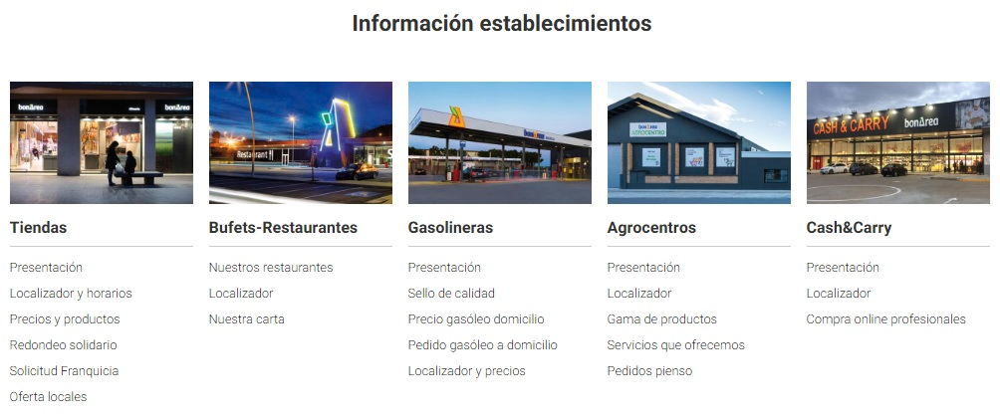
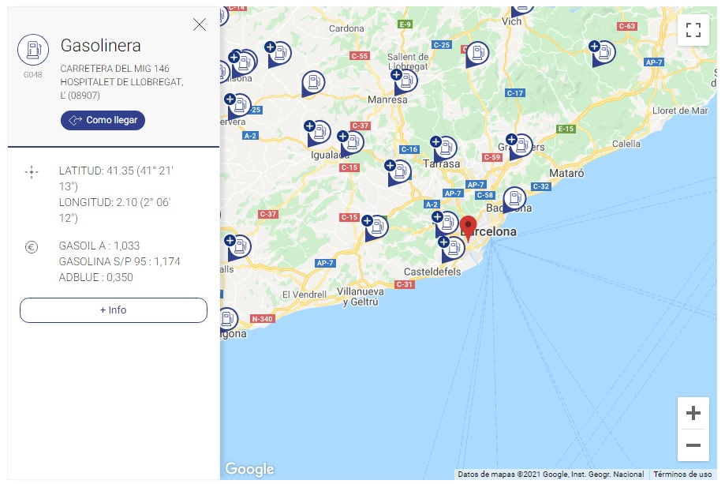
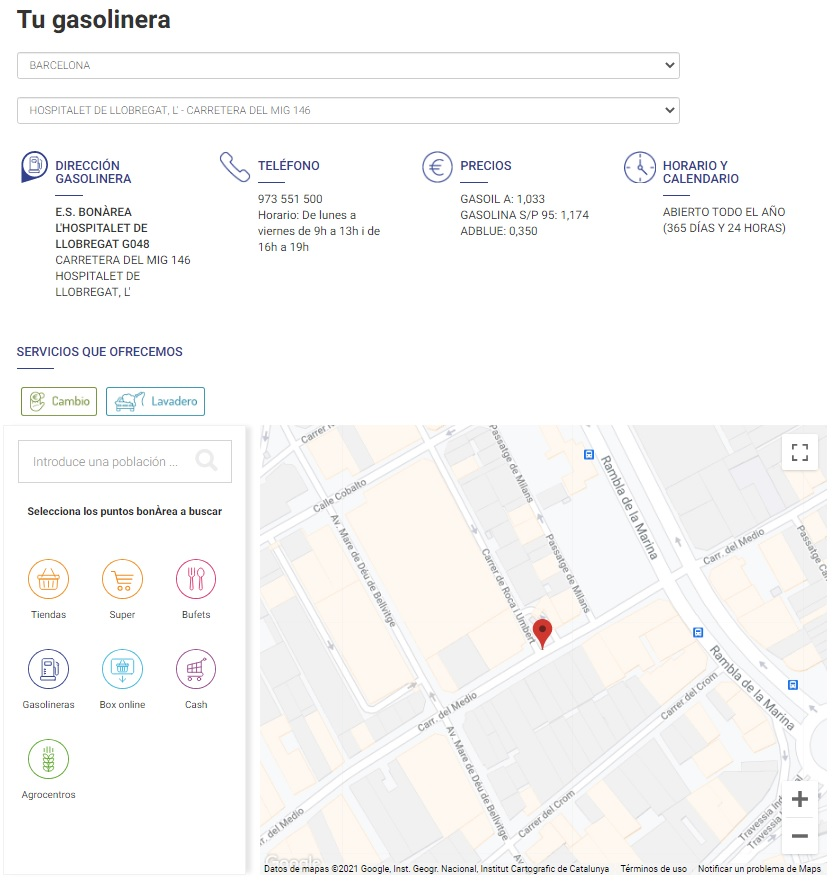
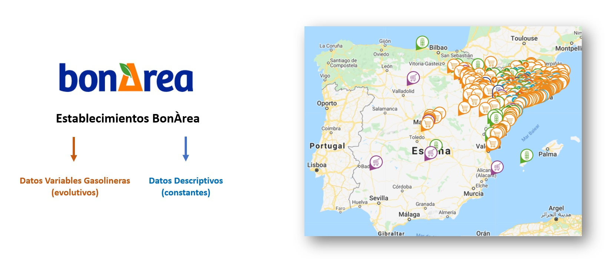
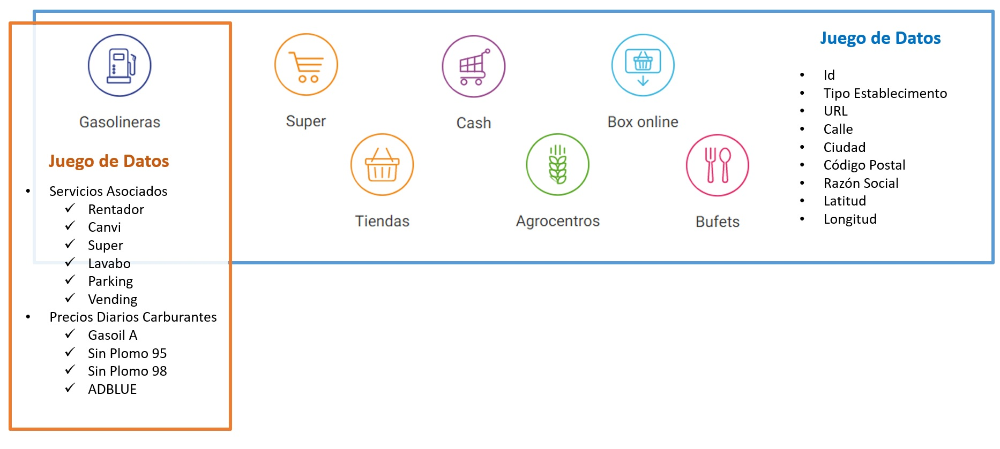
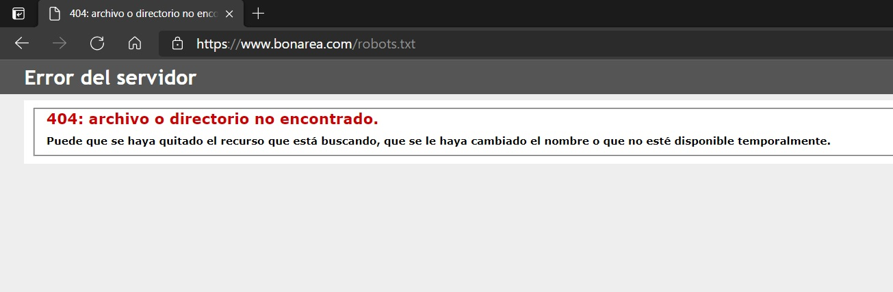
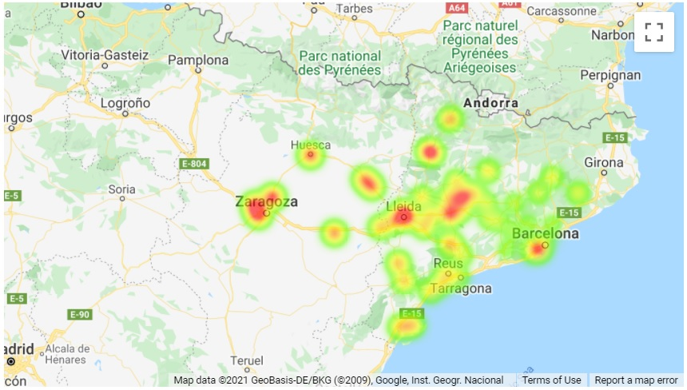
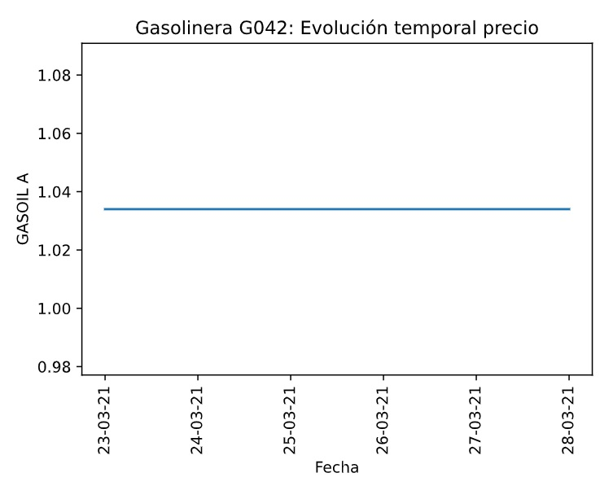
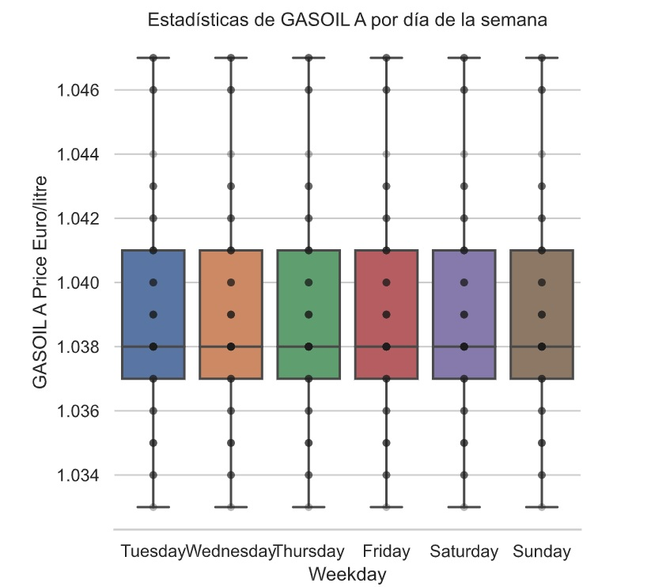

<style>
body {
text-align: justify}
</style>


```{r setup, include=FALSE}
knitr::opts_chunk$set(echo = TRUE, fig.align="center")
options(width = 500)

```

<br><br><br>

**INTRODUCCIÓN**

<br>
El presente informe forma parte de la primera práctica de la asignatura M2.851 - Tipología y ciclo de vida de los datos del Máster Universitario en Ciencia de Datos impartido por la Universitat Oberta de Catalunya.<p>
<br>

En esta práctica se realizarán técnicas de Web scraping aplicadas a una Web en concreto y se analizarán dichos datos para extraer información relevante y útil.<p>

<br>

A su vez, se entregará, junto con la presente memoria, una serie de archivos con el código necesario para la realización de dicho Web scraping y varios juegos de datos reales y actualizados con el que el usuario podrá realizar diferentes estudios analíticos a posteriori.<p> 

<br>


******
# **Contexto**
******

<br><br>


**1. Explicar en qué contexto se ha recolectado la información. Explique por qué el sitio web elegido proporciona dicha información**.

<br>

**Contexto en la recolección de la información.**<p>

<br>
La página web seleccionada para realizar las técnicas de Web scraping es: https://www.bonarea.com/ <p>
<br>


BonÀrea es empresa con una amplia experiencia en el sector agroalimentario, donde su principal negocio se desarrolla en actividades ganaderas, industriales y comerciales con el fin de poder llegar al consumidor sin intermediarios. <p>

Una de las divisiones de la empresa, bonÀrea Energía, dispone de más de 55 gasolineras que venden más de 430 millones de litros al año con un ratio calidad/precio que hace ahorrar más de 40 millones de euros al año a sus clientes.<p>

Las gasolineras bonÀrea son conocidas por su precio económico debido a sus reducidos márgenes de beneficio y al gran volumen de carburantes vendido, y además debido al uso de economías de escala entre sus diferentes líneas de negocio.<p>

Para ésta práctica, se ha decidido hacer un estudio geográfico y temporal de los precios de las gasolineras de bonÀrea Energía, para determinar, no solamente las variaciones diarias de los precios de los diferentes productos, sinó también realizar un registro de las economías de escala asociadas a cada gasolinera (servicios complementarios aportados por cada gasolinera).<p>

De igual forma, y debido a que la página web muestra información descriptiva y relevante de todos los establecimientos que BonÀrea tiene repartido a lo largo del territorio español (supermercados, tiendas, bufets, gasolineras, "Box online" de recogida, Centros de Agricultura y centros Cash para venta al mayor), se ha decidido recolectar y agrupar en un dataset dicha información.


<br>

**Información extraída del sitio web.**<p>

<br>
El dominio www.bonarea.com aporta una web dinámica que referencia a todas las divisiones de negocio del grupo, implementando diferentes esquemas de datos para que la experiencia del usuario final a nivel de visualización de la información sea clara y concisa.<p>

<br>

<p align="center">
  
</p>

<br>

En el apartado de los establecimientos, para todos ellos y en particular en el de las gasolineras, la página web aporta diferentes datos sobre ellas, tanto a nivel geográfico mediante un mapa interactivo para que el usuario sepa en todo momento dónde está la gasolinara más cercana, como a nivel económico (se muestran los precios de los diferentes carburantes disponibles en cada una de ellas).<p>

La página permite al usuario seleccionar uno o varios tipos de establecimientos y muestra la ubicación sobre el mapa de todos establecimientos de los tipos seleccionados.<p>

<br>

<p align="center">
  
</p>

<br>

Además, haciendo click en el icono **"+ info"**, cada establecimiento dispone de una página web anidada para que el usuario pueda tener información adicional como el horario de apertura, dirección , teléfono, etc. de cada uno de ellos.<p>

<br>

<p align="center">
  
</p>

<br>


En definitiva, el sitio web proporciona dicha información con solamente un motivo: conseguir el compromiso y la fidelización del cliente a una página web práctica y bien diseñada, que ayuda a obtener una información "a la carte" útil.<p>


<br>
Hay que tener en cuenta **dos puntos claves** relacionados con la interacción del usuario:<p>

<br>
-Durante la interacción del usuario con la web, los datos se generan de forma dinámica: la web envía una solicitud jquery de información y devuelve un conjunto de puntos en el mapa que cumplen con el criterio impuesto por el usuario. <p>

<br>
- Al hacer click en los distintos puntos que aparecen en el mapa, la página realiza otra solicitud jquery para una instancia de establecimiento específica y visualiza un recuadro con su información básica.  <p>
<br>


******
# **Título del dataset**
******

<br><br>


**2. Definir un título para el dataset. Elegir un título que sea descriptivo.**.


El proyecto puede generar el dataset en dos modalidades:<p>

<br>

<ul>
<li>**1. Dataset gasolineras en dos archivos csv:** csv con datos de las gasolineras y csv actualizable con histórico de precios diarios de las diferentes gasolineras.<p>
<li>**2. Dataset completo de todos los establecimientos en un archivo csv** (información descriptiva de los establecimientos)**<p>
</ul>

<br>

Por tanto, habrá 2 títulos propuestos para los diferentes datasets. Los títulos se muestran en orden de aparición en referencia a la anterior lista:<p>

<br>

<ul>
<li>**1.   "Información descriptiva de las gasolineras bonÀrea, servicios asociados y valores diarios del precio de los carburantes"**<p>
<li>**2.   "Establecimientos bonÀrea: Información descriptiva de los supermercados, tiendas, bufets, gasolineras, Box online, Centros de Agricultura y centros Cash."**<p>
</ul>


<br>

******
# **Descripción del dataset**
******

<br><br>


**3. Desarrollar una descripción breve del conjunto de datos que se ha extraído (es necesario que esta descripción tenga sentido con el título elegido).**.

"Información descriptiva de las gasolineras bonÀrea, servicios asociados y valores diarios del precio de los carburantes"<p>

El conjunto de datos muestra el identificador de cada gasolinera con la fecha y día de la semana de la extracción de la información.<p>
Además se incluye información básica de cada gasolinera (url, calle, ciudad, código postal, localización geográfica, servicios que provee en el propio establecimiento y los precios diarios de cada producto (Gasoil A, Gasolina sin plomo 95 y 98 y Adblue).<p>

Todos los atributos no tienen valores nulos excepto los servicios asociados y los productos de la gasolinera, donde pueden tomar valores nulos si tal servicio o producto no existe en esa determinada gasolinera.<p>


"Establecimientos bonÀrea: Información descriptiva de los supermercados, tiendas, bufets, gasolineras, Box online, Centros de Agricultura y centros Cash."<p>


El conjunto de datos muestra la misma información relevante que el anterior juego de datos para todos los tipos de establecimientos a excepción de los precios diarios por tipo de carburante.<p>  


<br>

******
# **Representación gráfica**
******

<br><br>


**4. Presentar esquema o diagrama que identifique el dataset visualmente y el proyecto elegido.**


<br>

<p align="center">
  
</p>

<br>

<br>

<p align="center">
  
</p>

<br>

<br>

******
# **Contenido**
******

<br><br>


**5. Explicar los campos que incluye el dataset, el periodo de tiempo de los datos y cómo se ha recogido.**   

<br>
El dataset contiene los precios diarios de los carburantes en distintas gasolineras de la red BonÀrea en el período de tiempo desde: <p>

<br>

23 de marzo de 2021 hasta la fecha de entrega de la práctica.<p>

<br>

Los diferentes datasets pueden ser generados en dos modalidades:<p>

<br>

**Dos ficheros csv**:<p>
<br>
**'bonarea_gasolineras_prices.csv'** - datos históricos del precio de los carburantes por gasolinera<p> 
**'bonarea_gasolineras.csv'** - datos de las gasolineras<p>
<br>

**Un fichero csv**:  
<br>
**'bonarea_gasolineras_data_and_prices.csv'** - datos históricos del precio de los carburantes por gasolinera con información detallada de cada gasolinera.<p>

<br>
-> **'bonarea_gasolineras_prices.csv'**<p>

<br>

<ul>
<li>**id** - número identificador de la gasolinera.<p>
<li>**Fecha** - fecha<p>
<li>**Dia_Semana** - día de la semana<p>
<li>**latitude** - latitud <p>
<li>**longitude** - longitud <p>
<li>**minutsLatitude** - latitud en minutos	<p>
<li>**minutsLongitude** - longitud en minutos  <p>
<li>**GASOIL A** - precio diario de este tipo de combustible<p>
<li>**GASOLINA S/P 95** - precio diario de este tipo de combustible<p>
<li>**GASOLINA S/P 98** - precio diario de este tipo de combustible<p>
<li>**ADBLUE** - precio diario de este tipo de combustible<p>
</ul>

<br>

 
-> **'bonarea_gasolineras.csv'**
<br>

<ul>
<li>**id** - número identificador de la gasolinera<p>
<li>**type** - tipo de establecimiento de BonÀrea	<p>
<li>**url**	- url de la gasolinera<p>
<li>**street** - calle donde se ubica la gasolinera <p>
<li>**city** - ciudad donde se ubica la gasolinera<p>
<li>**postalCode** - código postal de la dirección de la gasolinera	<p>
<li>**raoSocial**	- razón social del establecimiento <p>
<li>**latitude** - latitud <p>
<li>**longitude** - longitud <p>
<li>**minutsLatitude** - latitud en minutos<p>
<li>**minutsLongitude** - longitud en minutos<p>
<li>**RENTADO**R	- tiene túnel de lavado de coches (1 - sí)<p>
<li>**CANVI** - tiene cambio para dinero, booleano  (1 - sí)<p>
<li>**SUPER**	- tiene supermercado (1 - sí)<p>
<li>**LAVABO** - tiene lavabo (1 - sí)<p>
<li>**PARKING** - tiene parking (1 - sí)<p>
<li>**VENDING** - tiene vending (1 - sí)<p>
</ul>

<br>
-> **'bonarea_gasolineras_data_and_prices.csv'**

<br>
<ul>
<li>**id** - número identificador de la gasolinera.<p>
<li>**Fecha** - fecha**<p>
<li>**Dia_Semana** - día de la semana**<p>
<li>**type** - tipo de establecimiento de BonÀrea	<p>
<li>**url**	- url de la gasolinera**<p>
<li>**street** - calle donde se ubica la gasolinera <p>
<li>**city** - ciudad donde se ubica la gasolinera<p>
<li>**postalCode** - código postal de la dirección de la gasolinera	<p>
<li>**raoSocial**	- razón social del establecimiento <p>
<li>**latitude** - latitud <p>
<li>**longitude** - longitud <p>
<li>**minutsLatitude** - latitud en minutos<p>
<li>**minutsLongitude** - longitud en minutos<p>
<li>**RENTADOR**	- tiene túnel de lavado de coches (1 - sí)<p>
<li>**CANVI** - tiene cambio para dinero, booleano  (1 - sí)<p>
<li>**SUPER**	- tiene supermercado (1 - sí)<p>
<li>**LAVABO** - tiene lavabo (1 - sí)<p>
<li>**PARKING** - tiene parking (1 - sí)<p>
<li>**VENDING** - tiene vending (1 - sí)<p>
<li>**GASOIL A** - precio diario de este tipo de combustible**<p>
<li>**GASOLINA S/P 95** - precio diario de este tipo de combustible<p>
<li>**GASOLINA S/P 98** - precio diario de este tipo de combustible<p>
<li>**ADBLUE** - precio diario de este tipo de combustible<p>
</ul>
<br>

**Procedimiento de colección de datos**

La página permite al usuario seleccionar uno o varios tipos de establecimientos y muestra la ubicación sobre el mapa de todos establecimientos de los tipos seleccionados. <p>

<br>
Al hacer click en los distintos puntos que aparecen en el mapa, la página realiza otra solicitud jquery para una instancia de establecimiento específica y visualiza un recuadro con su información básica.<p>

<br>
Durante la interacción del usuario con la web, los datos se generan de forma dinámica: la web envía una solicitud jquery de información y devuelve un conjunto de puntos en el mapa que cumplen con el criterio impuesto por el usuario. <p>

<br>
Para realizar el webscraping se realiza en dos pasos:


<ul>
<li>**Id gasolineras** - encontramos el string que representa la solicitud jquery y usamos Postman (https://www.postman.com/) para obtener los campos `url`, `data`, `header`.<p>
<li>**Descripción detalle de las gasolineras** - usamos una lista de ids de gasolineras para solicitar información detallada de las gasolineras.<p>
</ul>


<br>

******
# **Agradecimientos**
******

Los datos han sido recolectados de la página web de BonÁrea. Para ello se han utilizado `requests` de Python y la aplicación `Postman` (https://www.postman.com/).<p>

<br>
Cabe mencionar que www.bonarea.com no dispone de ningún tipo de archivo "robots.txt", hecho que ha facilitado el scraping de la información con total libertad por parte de los estudiantes.<p>
<br><br>


<br>

<p align="center">
  
</p>

<br>


**6. Presentar al propietario del conjunto de datos. Es necesario incluir citas de análisis anteriores o, en caso de no haberlas, justificar esta búsqueda con análisis similares.**

///>>> PENDIENTE DE ELABORACION


<br>

******
# **Inspiración**
******

<br><br>


**7. Explique por qué es interesante este conjunto de datos y qué preguntas se pretenden responder. Es necesario comparar con los análisis anteriores presentados en el apartado 6.**

///>>> EN ELABORACION...


El juego de datos generado nos aporta la información sobre los precios diarios de los carburantes (por productos y por gasolineras) de la empresa BonÀrea.<p>

Esta información es realmente interesante para el usuario (y también para la competencia) puesto que se puede generar diferentes aplicaciones o visualizaciones que pueden ser base en toma de decisiones tanto particulares (el usuario puede elegir qué gasolinera repostar por ser más barata) como a nivel estratégico (la empresa competidora puede utilizarlos en su beneficio).<p>

Ejemplos de posibles gráficas que se podría generar, serían las siguientes:<p>

<br>


**Heatmap geográfico de precios (siendo el color rojo indicador de productos más caros):**<p>


<br>

<p align="center">
  
</p>

<br>


**Evolución temporal del precio del carburante por producto y por gasolinera:**<p>


<br>

<p align="center">
  
</p>

<br>


**Estadísticos de los precios de los carburantes por producto y por día de la semana:**<p>


<br>

<p align="center">
  
</p>

<br>


Como se puede observar, la información disponible es valiosa y útil en futuras tomas de decisiones.<p>


Por otro lado, el dataset también aporta información de los servicios asociados a cada gasolinera, donde éstos pueden ser:<p>

<br>

<ul>
<li>**RENTADOR**	- Tiene túnel de lavado de coches<p>
<li>**CANVI** - Tiene cambio para dinero, booleano<p>
<li>**SUPER**	- Tiene supermercado<p>
<li>**LAVABO** - Tiene lavabo<p>
<li>**PARKING** - Tiene parking<p>
<li>**VENDING** - Tiene vending<p>
</ul>

<br>

Y en consecuencia, además de la infomación adicional que el usuario pueda obtener de los diferentes servicios que aporta cada gasolinera, estadísticas sobre los precios de los carburantes mediante la agrupación de los diferentes servicios provistos, puede aportar información oculta, que a primera vista no trivial.<p>


<br>

******
# **Licencia**
******

<br><br>


**8. Seleccione una de estas licencias para su dataset y explique el motivo de su selección:**


<ul>
<li>**Released Under CC0: Public Domain License**<p>
<li>**Released Under CC BY-NC-SA 4.0 License**<p>
<li>**Released Under CC BY-SA 4.0 License**<p>
<li>**Database released under Open Database License, individual contents under Database Contents License**<p>
<li>**Other (specified above)**<p>
<li>**Unknown License**<p>
</ul>

<br>


///>>> PENDIENTE DE DECISION.


<br>

******
# **Código**
******

<br><br>


**9. Adjuntar el código con el que se ha generado el dataset, preferiblemente en Python o, alternativamente, en R.**

<P>

La generación del dataset se ha generado utilizando el lenguaje de programación Python.<p>

El código utilizado y archivos auxiliares se pueden encontrar en https://github.com/ bajo la siguiente dirección web:<p>

https://github.com/Carlos-Acosta/webscraping.git


<br>

******
# **Dataset**
******

<br><br>


**10. Publicación del dataset en formato CSV en Zenodo (obtención del DOI) con una breve descripción.**


///>>> PENDIENTE DE ELABORACIÓN DE LA ÚLTIMA VERSIÓN DEL DATASET...


<br>

******
# **Referencias**
******
<br>

-1- Lawson, R. (2015). _Web Scraping with Python_. Packt Publishing Ltd. Chapter 2. Scraping the Data.  
-2- Mitchel, R. (2015). _Web Scraping with Python: Collecting Data from the Modern Web_. O'Reilly Media, Inc. Chapter 1. Your First Web Scraper.  
-3- Lawson, R. (2015). _Web Scraping with Python_. Packt Publishing Ltd. Chapter 5. Dynamic Data.  

<br>
