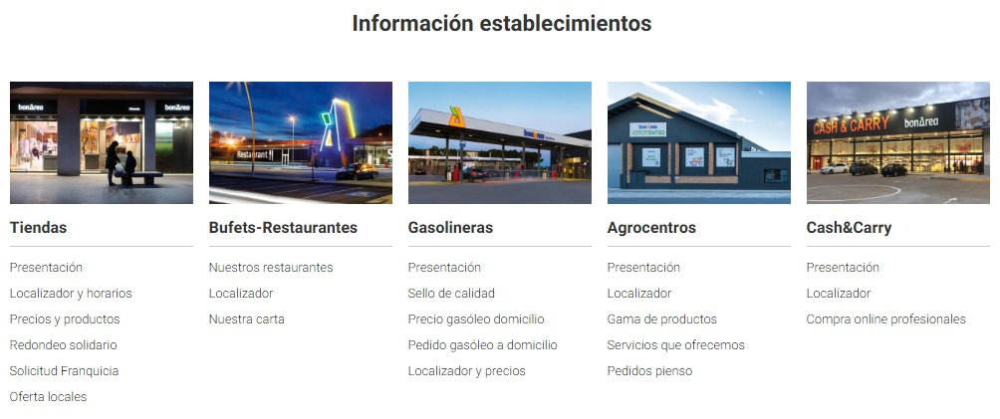

<style>
body {
text-align: justify}
</style>


```{r setup, include=FALSE}
knitr::opts_chunk$set(echo = TRUE, fig.align="center")
options(width = 500)

```

<br><br><br>

**INTRODUCCIÓN**

El presente informe forma parte de la primera práctica de la asignatura M2.851 - Tipología y ciclo de vida de los datos del Máster Universitario en Ciencia de Datos impartido por la Universitat Oberta de Catalunya.<p>.

En esta práctica se realizarán técnicas de Web scraping aplicadas a una Web en concreto y se analizarán dichos datos para extraer información relevante y útil.<p>

A su vez, se entregará, junto con la presente memoria, una serie de archivos con el código necesario para la realización de dicho Web scraping y varios juegos de datos reales y actualizados con el que el usuario podrá realizar diferentes estudios analíticos a posteriori.<p> 

<br>


******
# **Contexto**
******

<br><br>


**1. Explicar en qué contexto se ha recolectado la información. Explique por qué el sitio web elegido proporciona dicha información**.

<br>

## Contexto en la recolección de la información.<p>

La página web seleccionada para realizar las técnicas de Web scraping es: https://www.bonarea.com/ <p>


BonÀrea es empresa con una amplia experiencia en el sector agroalimentario, donde su principal negocio se desarrolla en actividades ganaderas, industriales y comerciales con el fin de poder llegar al consumidor sin intermediarios. <p>

Una de las divisiones de la empresa, bonÀrea Energía, dispone de más de 55 gasolineras que venden más de 430 millones de litros al año con un ratio calidad/precio que hace ahorrar más de 40 millones de euros al año a sus clientes.<p>

Las gasolineras bonÀrea son conocidas por su precio económico debido a sus reducidos márgenes de beneficio y al gran volumen de carburantes vendido, y además debido al uso de economías de escala entres sus diferentes líneas de negocio.<p>

Para ésta práctica, se ha decidido hacer un estudio geográfico y temporal de los precios de las gasolineras de bonÀrea Energía, para determinar, no solamente las variaciones diarias de los precios de los diferentes productos, sinó también realizar un registro de las economías de escala asociadas a cada gasolinera (servicios complementarios aportados por cada gasolinera).<p> 


*Información extraída del sitio web.*<p>

El dominio www.bonarea.com aporta una web dinámica que referencia a todas las divisiones de negocio del grupo, implementando diferentes esquemas de datos para que la experiencia del usuario final a nivel de visualización de la información sea clara y concisa.<p>

<p align="center">
  
</p>


En el apartado de los establecimientos, y en particular en el de las gasolineras, la página web aporta diferentes datos sobre ellas, tando a nivel geográfico mediante un mapa interactivo para que el usuario sepa en todo momento dónde está la gasolinara más cercana, como a nivel económico (se muestran los precios de los diferentes carburantes disponibles en cada una de ellas).<p>


Cada gasolinera dispone de una página web anidada para que el usuario pueda tener información adicional como el horario de apertura, dirección , teléfono, etc. de cada una de los establecimientos.<p>

En definitiva, el sitio web proporciona dicha información con solamente un motivo: conseguir el compromiso y la fidelización del cliente a una página web práctica y bien diseñada, que ayuda a obtener una información "a la carte" útil.<p>

OLGA: La página permite al usuario seleccionar uno o varios tipos de establecimientos y muestra la ubicación sobre el mapa de todos establecimientos de los tipos seleccionados. <p>
OLGA: Durante la interacción del usuario con la web, los datos se genera de forma dinámica: la web envía una solicitud jquery de información y devuelve un conjunto de puntos en el mapa que cumplen con el criterio impuesto por el usuario. <p>
OLGA: Al hacer click en los distintos puntos que aparecen en el mapa, la página realiza otra solicitud jquery para una instancia de establecimiento específica y visualiza un recuadro con su información básica.  <p>
<br>


******
# **Título del dataset**
******

<br><br>


**2. Definir un título para el dataset. Elegir un título que sea descriptivo.**.


SSSSSSSSSSSSSSSSSSSSSSSSSSSSSSSSSSSSSSSSSSSSSSSSSSSSSSSSSSSSSSSSSSSSSSSSSSSSSSSSSSSSSSSSSSSSSSS
OLGA: Valores diarios del precio de los carburantes en gazolineras bonÀrea.

******
# **Descripción del dataset**
******

<br><br>


**3. Desarrollar una descripción breve del conjunto de datos que se ha extraído (es necesario que esta descripción tenga sentido con el título elegido).**.


******
# **Representación gráfica**
******

<br><br>


**4. Presentar esquema o diagrama que identifique el dataset visualmente y el proyecto elegido.**


******
# **Contenido**
******

<br><br>


**5. Explicar los campos que incluye el dataset, el periodo de tiempo de los datos y cómo se ha recogido.**   

El dataset contiene los precios diarios de los carburantes en distintas gasolineras de la red BonÀrea en el período de tiempo desde el 23 de marzo de 2021 hasta la fecha de entrega de la práctica.  

El dataset XXXXXXXX XXXXXXx XXXXXXxxx puede ser generado en dos modalidades:  
* Dos ficheros csv:  
  - bonarea_gasolineras_prices.csv - datos históricos del precio de los carburantes por gasolinera   
  - bonarea_gasolineras.csv - datos de las gasolineras 

* Un fichero csv:  
  - bonarea_gasolineras_data_and_prices.csv - datos históricos del precio de los carburantes por gasolinera con información detallada de cada gasolinera 


bonarea_gasolineras_prices.csv
* id - número identificador de la gasolinera
* Fecha - fecha
* Dia_Semana - día de la semana
* latitude - latitud  
* longitude - longitud 
* minutsLatitude - latitud en minutos	
* minutsLongitude - longitud en minutos  
* GASOIL A - precio diario de este tipo de combustible
* GASOLINA S/P 95 - precio diario de este tipo de combustible
* GASOLINA S/P 98 - precio diario de este tipo de combustible
* ADBLUE - precio diario de este tipo de combustible

bonarea_gasolineras.csv
* id - número identificador de la gasolinera
* type - tipo de establecimiento de BonÀrea	 
* url	- url de la gasolinera   
* street - calle donde se ubica la gasolinera  
* city - ciudad donde se ubica la gasolinera
* postalCode - código postal de la dirección de la gasolinera	 
* raoSocial	- razón social del establecimiento   
* latitude - latitud  
* longitude - longitud 
* minutsLatitude - latitud en minutos	
* minutsLongitude - longitud en minutos  
* RENTADOR	- tiene túnel de lavado de coches (1 - sí)
* CANVI - tienen cambio para dinero, booleano  (1 - sí)
* SUPER	- tiene supermercado (1 - sí)
* LAVABO - tiene lavabo (1 - sí)
* PARKING - tiene parking (1 - sí)
* VENDING - tiene vending (1 - sí)

bonarea_gasolineras_data_and_prices.csv
* id - número identificador de la gasolinera
* Fecha - fecha
* Dia_Semana - día de la semana
* type - tipo de establecimiento de BonÀrea	 
* url	- url de la gasolinera   
* street - calle donde se ubica la gasolinera  
* city - ciudad donde se ubica la gasolinera
* postalCode - código postal de la dirección de la gasolinera	 
* raoSocial	- razón social del establecimiento   
* latitude - latitud  
* longitude - longitud 
* minutsLatitude - latitud en minutos	
* minutsLongitude - longitud en minutos  
* RENTADOR	- tiene túnel de lavado de coches (1 - sí)
* CANVI - tienen cambio para dinero  (1 - sí)
* SUPER	- tiene supermercado (1 - sí)
* LAVABO - tiene lavabo (1 - sí)
* PARKING - tiene parking (1 - sí)
* VENDING - tiene vending (1 - sí)
* GASOIL A - precio diario de este tipo de combustible
* GASOLINA S/P 95 - precio diario de este tipo de combustible
* GASOLINA S/P 98 - precio diario de este tipo de combustible
* ADBLUE - precio diario de este tipo de combustible


*Procedimiento de colección de datos*  

La página permite al usuario seleccionar uno o varios tipos de establecimientos y muestra la ubicación sobre el mapa de todos establecimientos   
de los tipos seleccionados. <p>  

Al hacer click en los distintos puntos que aparecen en el mapa, la página realiza otra solicitud jquery para una instancia de establecimiento  
específica y visualiza un recuadro con su información básica.  <p>

Durante la interacción del usuario con la web, los datos se generan de forma dinámica: la web envía una solicitud jquery de información y  
devuelve un conjunto de puntos en el mapa que cumplen con el criterio impuesto por el usuario. <p>

Para realizar el webscraping se realiza en dos pasos:  
* id gasolineras - encontramos el string que representa la solicitud jquery y usamos Postman (https://www.postman.com/) para obtener los campos `url`, `data`, `header`.  
* detalle gasolineras - usamos una lista de ids de gasolineras para solicitar información detallada de las gasolineras.  

******
# **Agradecimientos**
******

Los datos han sido recolectados de la página web de BonÁrea. Para ello se han utilizado `requests` de Python y la aplicación `Postman` (https://www.postman.com/)  
<br><br>


**6. Presentar al propietario del conjunto de datos. Es necesario incluir citas de análisis anteriores o, en caso de no haberlas, justificar esta búsqueda con análisis similares.**


******
# **Inspiración**
******

<br><br>


**7. Explique por qué es interesante este conjunto de datos y qué preguntas se pretenden responder. Es necesario comparar con los análisis anteriores presentados en el apartado 6.**


******
# **Licencia**
******

<br><br>


**8. Seleccione una de estas licencias para su dataset y explique el motivo de su selección:**


<ul>
<li>**Released Under CC0: Public Domain License**<p>
<li>**Released Under CC BY-NC-SA 4.0 License**<p>
<li>**Released Under CC BY-SA 4.0 License**<p>
<li>**Database released under Open Database License, individual contents under Database Contents License**<p>
<li>**Other (specified above)**<p>
<li>**Unknown License**<p>
</ul>

******
# **Código**
******

<br><br>


**9. Adjuntar el código con el que se ha generado el dataset, preferiblemente en Python o, alternativamente, en R.**


******
# **Dataset**
******

<br><br>


**10. Publicación del dataset en formato CSV en Zenodo (obtención del DOI) con una breve descripción.**


******
# **Referencias**
******
<br>
